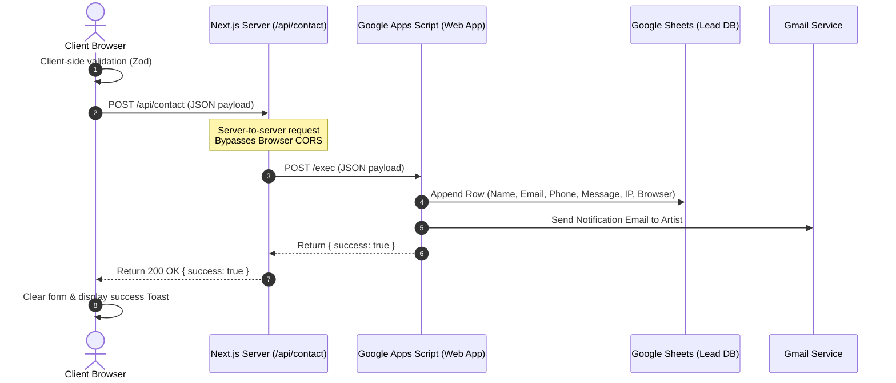

# Developer & Architecture Documentation

## Project Name: Parth Prajapati – Premium Drawing Artist Portfolio
**Agency:** GM Web Studio  
**Developer:** Gaurav Mandli  
**Version:** 1.0.0  

---

## Table of Contents
1. [Project Overview](#1-project-overview)
2. [Business Requirements](#2-business-requirements)
3. [Technology Stack](#3-technology-stack)
4. [Project Architecture](#4-project-architecture)
5. [Folder Structure](#5-folder-structure)
6. [Components Documentation](#6-components-documentation)
7. [Data Schema & Content Management](#7-data-schema--content-management)
8. [Contact Form & Backend Integration](#8-contact-form--backend-integration)
9. [Theme & Styling System](#9-theme--styling-system)
10. [Animation Architecture](#10-animation-architecture)
11. [Performance & SEO Optimization](#11-performance--seo-optimization)
12. [Troubleshooting & Maintenance](#12-troubleshooting--maintenance)
13. [Future Roadmap](#13-future-roadmap)

---

## 1. Project Overview

The **Parth Prajapati Portfolio** is a luxury-grade digital exhibition and client-acquisition platform built for a professional fine-art drawing artist and educator. The website showcases the artist's technical mastery in charcoal, pencil, and color drawings while converting visitors into commission clients or art students.

---

## 2. Business Requirements

The application satisfies the following commercial requirements:
- **Exhibition-Grade Portfolio:** High-fidelity display of drawings with zoom, pan, and details (medium, dimensions, year).
- **Lead Acquisition:** A validated contact form capturing commissions, inquiries, and student enrollments.
- **Drawing Mentorship Promotion:** Presenting structured details of physical and digital art courses.
- **Automated Operations:** Synchronizing form submissions directly with a Google Sheet and triggering instant Gmail notifications.

---

## 3. Technology Stack

| Technology | Purpose | Selection Rationale |
| :--- | :--- | :--- |
| **Next.js 16** | Core Framework | App Router, Server-Side Rendering (SSR), and Server API Routes for proxying requests. |
| **React 19** | UI Library | Component-driven architecture and hook-based state management. |
| **TypeScript** | Language | Static typing, compile-time safety, and self-documenting code. |
| **Tailwind CSS** | Styling | Utility-first styling combined with CSS variables for seamless theme switching. |
| **Framer Motion** | Animation | Fluid, declarative transitions, layout animations, and gesture-driven overlays. |
| **GSAP & ScrollTrigger** | Scroll Effects | High-performance scroll-driven animations and parallax timelines. |
| **Lenis** | Smooth Scroll | Smooth scrolling experience across browsers. |
| **Google Apps Script** | Integration | Serverless API handling spreadsheet writing and email notification delivery. |

---

## 4. Project Architecture

The application utilizes a **Proxy-Backend Architecture** to bypass browser CORS preflight blocks when communicating with Google Apps Script.

### Data Flow Diagram


---

## 5. Folder Structure

Detailed breakdown of the workspace layout:
- **`public/`**: Stores static assets. Avatars are located in `public/images/testimonials/` and gallery files in `public/images/gallery/`.
- **`src/app/`**: Contains page files, layout wrappers, and API routes.
  - **`api/contact/route.ts`**: Handles server-side forwarding of contact submissions.
  - **`globals.css`**: Defines CSS variables for styling and theme tokens.
- **`src/components/`**: House React components.
- **`src/data/`**: Structured JSON data files for easy content updates.

---

## 6. Components Documentation

### Hero
- **Purpose:** Cinematic landing section introducing the artist and a featured masterpiece.
- **Animations:** Floating framed artwork, parallax elements, and fade-in typography.
- **Aesthetics:** Elegant gold border frames with a floating details card.

### Gallery
- **Purpose:** Filterable artwork grid with dynamic category counts.
- **Filters:** `ALL`, `MASTERPIECES`, `PENCIL`, `COLOUR`, `EXHIBITIONS`.
- **Interactivity:** Clicking `EXHIBITIONS` smoothly scrolls to the Exhibition section without reloading. Includes an `IntersectionObserver` that highlights the active filter based on scroll position.

### Contact
- **Purpose:** Input form with real-time validation and submission state handling.
- **Features:** Reusable `FormField` components, GPU-accelerated floating labels, and Chrome autofill overrides.

---

## 7. Data Schema & Content Management

All text, images, and FAQs are managed through JSON files in `src/data/`.
Example schema for `gallery.json`:
```json
{
  "id": "artwork-1",
  "title": "Melody of Divine Grace",
  "category": "masterpiece",
  "medium": "Charcoal & Graphite on Paper",
  "dimensions": "22" x 30"",
  "year": "2024",
  "image": "/images/gallery/melody_of_divine_grace.jpg",
  "tags": ["Krishna", "Realism", "Spiritual"]
}
```

---

## 8. Contact Form & Backend Integration

The contact form is powered by **React Hook Form** and validated via **Zod**.

### Submission Payload Schema
```typescript
interface ContactPayload {
  name: string;
  email: string;
  phone: string;
  subject: string;
  message: string;
  ip: string;       // Fetched via https://api.ipify.org
  browser: string;  // navigator.userAgent
  device: string;   // Mobile or Desktop
}
```

---

## 9. Theme & Styling System

The application implements a premium, dual-theme design system using Tailwind CSS and CSS variables.

### Theme Variables (`src/app/globals.css`)
```css
:root {
  --background: #FAF8F5;          /* Light Cream */
  --background-secondary: #F3EFE8;/* Darker Cream */
  --card: #FFFFFF;                /* White */
  --text-primary: #1C1C1C;        /* Charcoal Black */
  --text-secondary: #5A5A5A;      /* Slate Grey */
  --accent: #B08A5A;              /* Premium Gold */
  --border: rgba(0, 0, 0, 0.08);  /* Soft Border */
}

.dark {
  --background: #0A0A0A;          /* Pure Dark */
  --background-secondary: #111111;/* Card Dark */
  --card: #161616;                /* Element Dark */
  --text-primary: #FAF8F5;        /* Light Cream */
  --text-secondary: #A0A0A0;      /* Muted Silver */
  --accent: #E6D0B3;              /* Champagne Gold */
  --border: rgba(255, 255, 255, 0.08);
}
```

---

## 10. Animation Architecture

- **Lenis:** Handles smooth scrolling, eliminating page stutter.
- **GSAP & ScrollTrigger:** Drives parallax scrolling on artwork frames and letter-fade reveals.
- **Framer Motion:** Powers the lightbox transitions, sliding testimonials, and the floating Back to Top button.

---

## 11. Performance & SEO Optimization

- **Image Optimization:** Utilizes Next.js `<Image>` for WebP conversion, lazy loading, and sizing.
- **SEO Best Practices:** Unique metadata, descriptive headings (`h1`), and structured OpenGraph tags.
- **Accessibility:** High color contrast ratios, screen-reader labels, and logical keyboard navigation.

---

## 12. Troubleshooting & Maintenance

- **CORS Errors:** Solved. All requests are routed through `/api/contact` to prevent browser CORS blocks.
- **Autofill Blue Backgrounds:** Resolved. Custom CSS overrides in `globals.css` force autofill backgrounds to match the active theme.

---

## 13. Future Roadmap

- **Headless CMS:** Integrate Sanity.io or Strapi for managing artworks and blog posts.
- **E-Commerce Store:** Add Stripe checkout for selling original drawings and prints.
- **Class Booking System:** Integrated calendar for scheduling 1-on-1 mentorship sessions.

---
*Designed and developed by GM Web Studio.*
